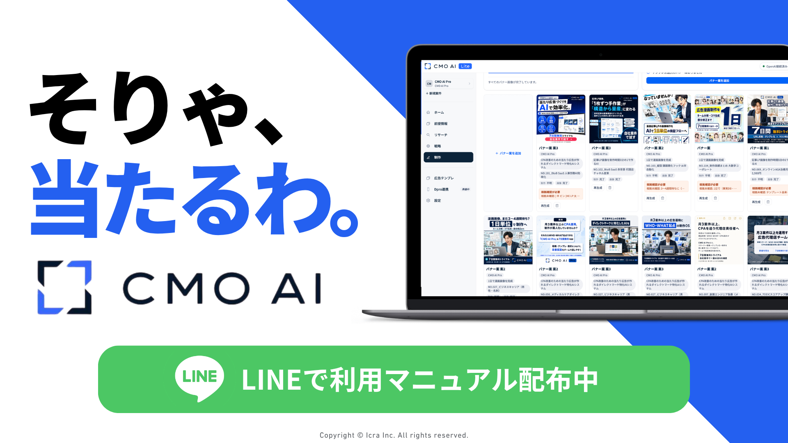

# CMO AI Lite （無料ダイレクトマーケAIシステム）

CMO AI Liteは、広告運用者が「前提情報 → 事実リサーチ → WHO-WHAT戦略 → バナー画像テンプレ → バナー制作」を実施するためのダイレクトマーケティングに特化したAIシステムです。
データはすべてローカルPCのフォルダに保存されます。

[](https://line-harness.kokami.workers.dev/auth/line?ref=be65354e-968e-46ac-a93a-e70d8729048e&form=3459ae33-6cb9-42a9-9242-9936c3bac104&pool=main)

## ダウンロード

**[CMO AI Lite 最新版をダウンロード（CMO-AI-Lite.zip）](https://github.com/k4415/CMO-AI-Lite/releases/latest/download/CMO-AI-Lite.zip)**

ZIPを解凍すると `CMO-AI-Lite` フォルダになります。
Gitを利用する場合は `git clone https://github.com/k4415/CMO-AI-Lite.git` でも取得できます。

## できること

- **前提情報** — 商品マスター、表現レギュレーション、商品画像・ロゴ
- **事実リサーチ** — 商品URLの内部LP解析とWeb検索から事実DBを構築
- **WHO-WHAT戦略** — 事実にもとづく戦略案の生成・編集
- **バナー画像テンプレ** — 自社制作NO.001〜100の標準テンプレと新規テンプレ化
- **バナー制作** — copyBrief + promptJson → `gpt-image-2` による画像生成

## 利用条件

本リポジトリは**厳密なOSSではなく**、株式会社Icraが権利を持つ**ソース公開版**です（`LICENSE` 参照）。

- 自社またはクライアントの広告制作・広告運用業務での利用は可能
- 生成物の商用利用は可能（OpenAI等の利用規約、素材権利、広告法令の確認は利用者責任）
- GitHub上での閲覧・fork、許可範囲内の私的改変は可能
- ツール本体・改変版の販売、有償提供、SaaS化、GitHub外での再配布、第三者への提供は禁止

## 必要環境

- **Node.js 20以上**
- **OpenAI APIキー**（事実抽出、WHO-WHAT、バナー Stage 2、`gpt-image-2` 画像生成に使用、従量課金）
- **Anthropic APIキー**（バナー Stage 1 の copyplan に使用）
- LP分析用Chromeは `npm install` 時に自動準備（失敗時は `npm run setup-browser`）

## セットアップ

1. 上記のZIPをダウンロードして解凍するか、Gitでリポジトリを取得
2. 依存関係をインストールして起動

```bash
cd CMO-AI-Lite
npm install
npm run dev
```

3. ブラウザで `http://localhost:5173` を開く
4. **設定** 画面で OpenAI APIキーと Anthropic APIキーを保存（`local-secrets/` にのみ保存、Git管理外）

## 最初のバナーまで

1. **新規案件** — 商品名・LP / 記事LP URL・簡易説明（任意）を入力（商品名がそのまま案件名、1案件=1商品）
2. **前提情報** — 商品画像・ロゴ・表現レギュレーションを整える
3. **LP解析 + 網羅リサーチ** — 事実DBを構築（「リサーチ > 事実」で確認・編集）
4. **戦略生成** — WHO-WHAT案を生成・編集
5. **バナー案を追加** — 戦略・テンプレ・参照画像を選び、最大5枚まで追加
6. **画像生成** — `gpt-image-2` で完成画像を出力

セットアップマニュアル・利用マニュアルはLINEにてお配りしています。
**[LINEに登録してマニュアルを受け取る](https://line-harness.kokami.workers.dev/auth/line?ref=be65354e-968e-46ac-a93a-e70d8729048e&form=3459ae33-6cb9-42a9-9242-9936c3bac104&pool=main)**

## Claude Code / Codex から使う

手元のターミナルで Claude Code または Codex をこのフォルダで起動し、自然言語で指示します。

- エージェント向け前提: `AGENTS.md`
- 操作API・データ配置: `docs/agent-operations.md`
- 利用者スキル（4件）: `.claude/skills/` および `.agents/skills/`
  - `cmoai-research` / `cmoai-who-what` / `cmoai-template` / `cmoai-banner`

エージェントのサブスク実行ではテキスト生成はローカル作業モデルで行い、UI/API実行では Stage 1 copyplan に Anthropic、Stage 2 と画像生成に OpenAI を使います。

## データとAPIキーの保存場所

| 種類 | パス |
| --- | --- |
| 案件DB | `projects/{案件名}/data/` |
| 商品画像・ロゴ | `projects/{案件名}/assets/products/{productId}/` |
| LP解析スクリーンショット | `projects/{案件名}/outputs/material-screenshots/` |
| 生成バナー画像 | `projects/{案件名}/outputs/banners/{bannerId}/` |
| 共通広告テンプレ（正本） | `data/ad-templates.json` |
| テンプレ配布manifest | `data/default-ad-templates.csv`（JSON再生成元**ではない**） |
| 標準テンプレ画像 | `data/default-ad-template-images/`（NO.001〜100） |
| APIキー | `local-secrets/openai.json`, `local-secrets/anthropic.json`（Git管理外） |

案件フォルダ `projects/*` は `.gitignore` 対象です。バックアップはフォルダごとコピーしてください。

## テンプレデータの保守

- **正本**: `data/ad-templates.json`（AI解析データを含む100件）
- **manifest**: `data/default-ad-templates.csv`（画像・タイトル等の配布用。JSON再生成元ではない）
- **保守コマンド**: `npm run templates:sanitize-bundled` — 現在のJSONから bundled 100件を残し、Lite配布対象外のフィールドだけを除去

## トラブルシューティング

- **OpenAI APIキーが未設定** — 設定画面で保存するか `OPENAI_API_KEY` を設定
- **Anthropic APIキーが未設定でバナー生成が止まる** — 設定画面で保存するか `ANTHROPIC_API_KEY` を設定
- **LPスクリーンショットが撮れない** — `CHROME_PATH` を設定。HTML本文のみでも続行可能
- **ポート使用中** — `PORT=5174 npm run dev`

## ライセンス

`LICENSE`（CMO AI Lite Source-Available License Version 1.0）を参照。第三者ライブラリは `THIRD_PARTY_NOTICES.md` を参照。

## 開発者
鴻上善彦（YoshihikoKokami） — CMO AI開発者、株式会社Icra 代表

X: https://x.com/k_4415
note：https://note.com/k4415